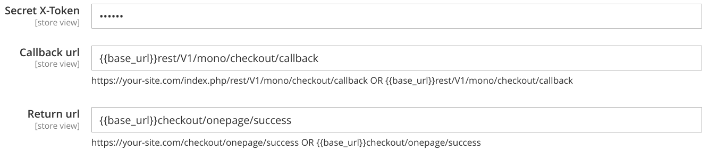
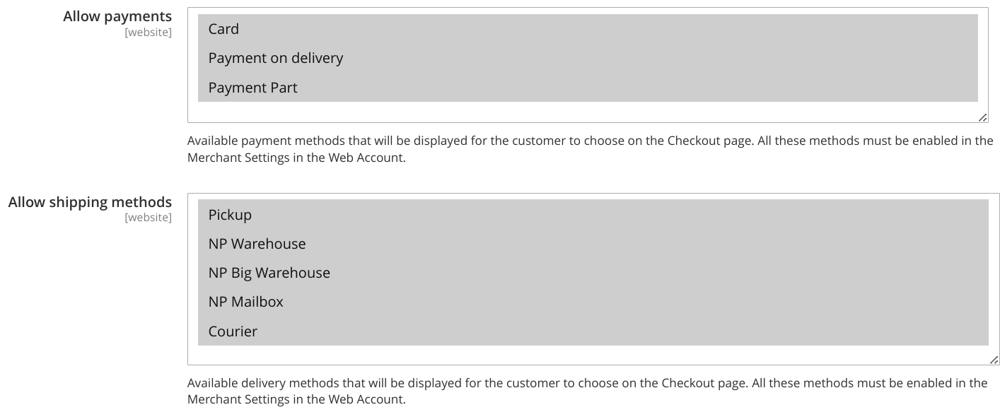
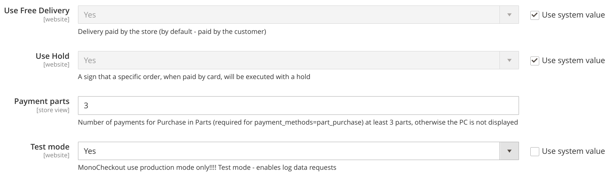
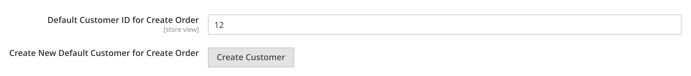
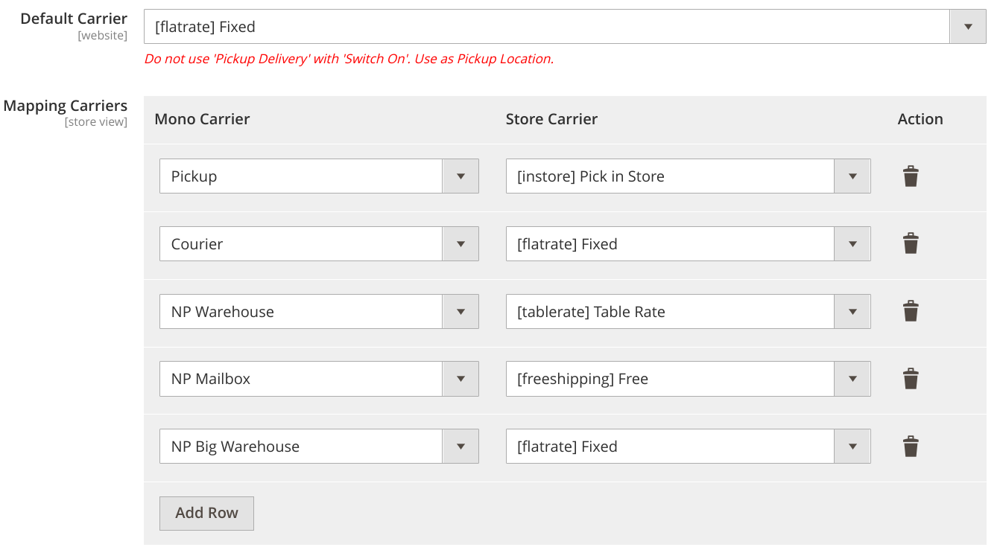
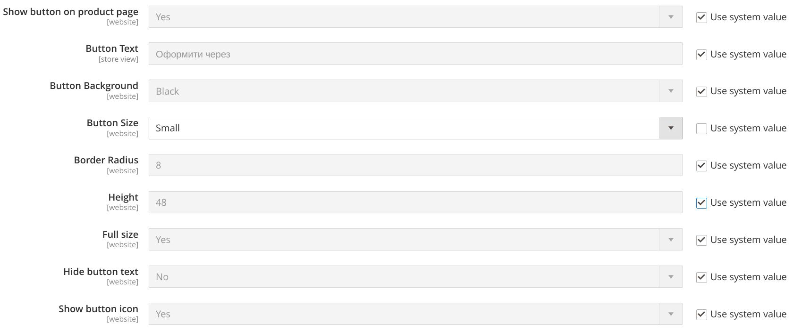

# Configuration of MonoCheckout Module for Magento 2

## General Settings

### Module Activation
- **Path**: `Stores → Configuration → Sales → Payment Methods → Mono Checkout`
- **Enabled**: Set to "Yes" to activate the Mono payment module
> 

### Basic Parameters
- **Title**: The name of the payment method that will be displayed to customers
- **Sort Order**: Sort order among other payment methods

## API Settings

### Connection Parameters
- **Merchant Token/X-Token**: Secret token for authorizing requests to the Mono API
- **Callback URL (POST)**: URL for processing callback requests from MonoBank
    - Example: `https://your-site.com/index.php/rest/V1/mono/checkout/callback`
- **Redirect URL (GET)**: URL for redirecting the customer after payment
    - Example: `https://your-site.com/checkout/onepage/success`
> 

### Available Payment Methods
The module supports the following payment types:
- **Card**: Payment by bank card
- **Payment upon receipt**: Payment upon receipt of the goods
- **Installment payment**: Payment by installments

### Available Shipping Methods
The module supports the following shipping types:
- **Pickup**: Pickup from the store
- **NP Warehouse**: Ordinary Warehouse Nova Poshta
- **NP Big Warehouse**: Department for large loads Nova Poshta
- **NP Mailbox**: Mailbox Nova Poshta
- **Courier**: Delivery by courier
> 

### Additional settings
- **Use Free Delivery**: Delivery paid by the store (by default - paid by the customer)
- **Use Hold**: A sign that a specific order, when paid by card, will be executed with a hold
- **Payment parts**: Number of payments for Purchase in Parts (required for payment_methods=part_purchase) at least 3 parts, otherwise the PC is not displayed
- **Test Mode**: MonoCheckout use production mode only!!!! Test mode - enables log data requests
> 

## Place Order Section

### Default customer settings
- **Default Customer ID for Create Order**: Initially, the order will be created for the default customer.
- **Create New Default Customer for Create Order**: Or create a new customer for orders
> 

### Delivery Services Mapping
- **Default Carrier**: Select default shipping method for create order
- **Configure the correspondence between Mono delivery services and your store's delivery services**:

| Mono Delivery Service | Store Delivery Service |
|---------------------|--------------------------|
| Pickup | Pickup in Store |
> 

### Restrictions for Installment Payments
- **Minimum Order Total**: Minimum order amount
- **Maximum Order Total**: Maximum order amount
- **Only for Downloadable/Virtual Products**: Restrict usage for virtual products
> 

## Payment Buttons Settings

### Show button on front: Product Page, Mini Cart, Cart, Checkout
- **Show Button**: Show button on some place
- **Button Text**: Button text (e.g., "Buy Now with Mono")
- **Button Background**: Button background color - Black or White
- **Button Size**: Button size - Small or Standard
- **Border Radius**: Button corner radius
- **Height**: Button height
- **Full Width**: Occupy the full available width
- **Hide Button Text**: Hide button text
- **Show Button Icon**: Show button icon
> 

---

> ❗ Important Notes
1. The module does not have a test mode and always accepts funds to the official sole proprietor account
2. Ensure that the callback URL is correctly configured and accessible from external networks
3. Configure the delivery services mapping for the correct operation of the module
4. Check the payment button settings on different store pages

For additional information, refer to the MonoBank documentation or contact the module developer.