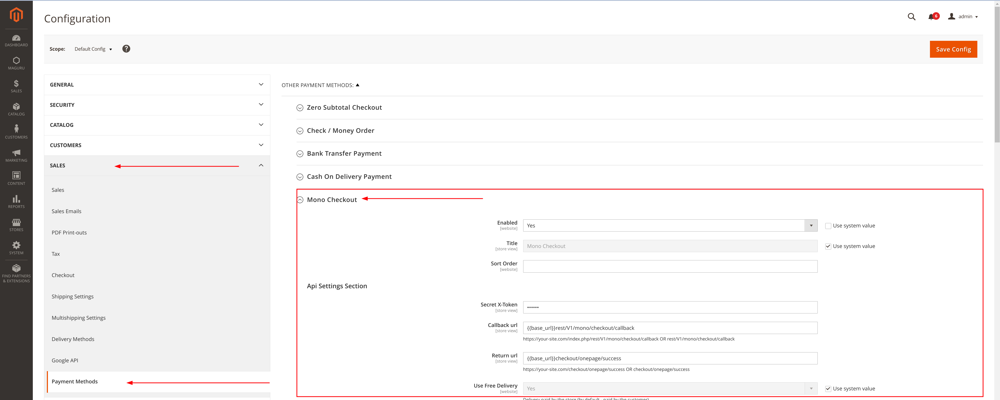
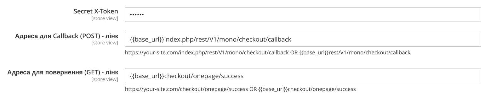
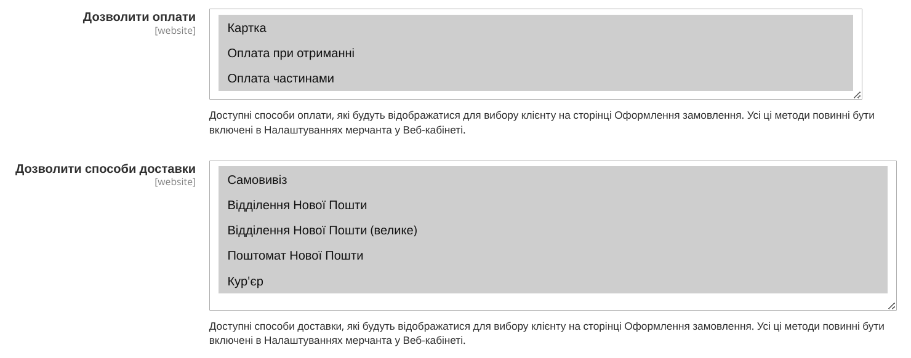
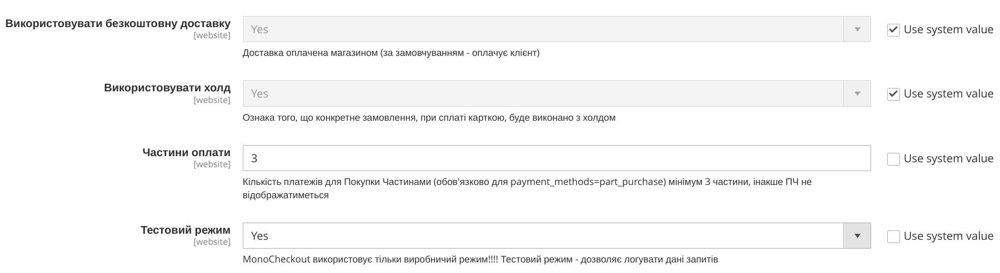
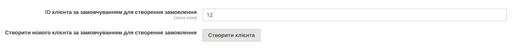
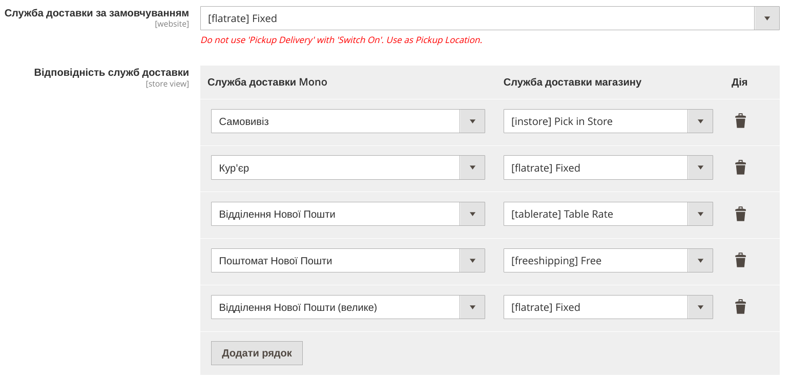
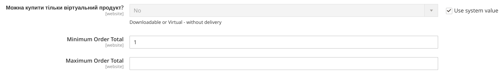
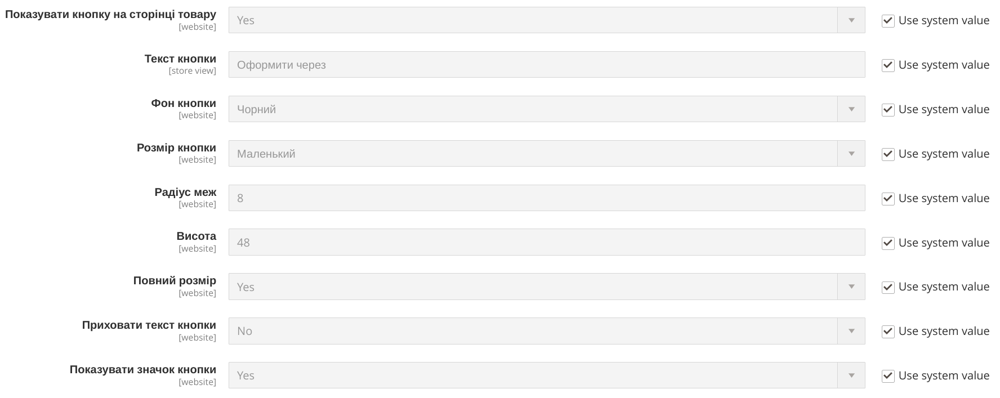

# Конфігурація модуля MonoCheckout для Magento 2

## Загальні налаштування

### Активування модуля
- **Шлях**: `Stores → Configuration → Sales → Payment Methods → Mono Checkout`
- **Enabled**: Встановіть "Yes" для активації модуля оплати Mono
> 

### Основні параметри
- **Title**: Назва методу оплати, яка відображатиметься клієнтам
- **Sort Order**: Порядок сортування серед інших методів оплати

## Налаштування API

### Параметри підключення
- **Merchant Token/X-Token**: Секретний токен для авторизації запитів до API Mono
- **Callback URL (POST)**: URL для обробки callback-запитів від MonoBank
    - Приклад: `https://your-site.com/index.php/rest/V1/mono/checkout/callback`
- **Redirect URL (GET)**: URL для перенаправлення клієнта після оплати
    - Приклад: `https://your-site.com/checkout/onepage/success`
> 

### Доступні методи оплати
Модуль підтримує наступні типи оплати:
- **Картка**: Оплата банківською карткою
- **Оплата при отриманні**: Оплата при отриманні товару
- **Оплата частинами**: Розстрочка платежу

### Доступні способи доставки
Модуль підтримує наступні способи доставки:
- **Самовивіз**: Самовивіз з магазину
- **Відділення Нової Пошти**: Звичайне відділення Нової Пошти
- **Відділення Нової Пошти (велике)**: Відділення для великогабаритних вантажів Нової Пошти
- **Поштомат Нової Пошти**: Поштомат Нової Пошти
- **Кур'єр**: Доставка кур'єром
> 

### Додаткові налаштування
- **Use Free Delivery**: Доставка оплачується магазином (за замовчуванням - оплачується клієнтом)
- **Use Hold**: Ознака того, що конкретне замовлення при оплаті карткою буде виконано з холдом
- **Payment parts**: Кількість платежів для Купівлі Частинами (обов'язково для payment_methods=part_purchase) мінімум 3 частини, інакше не відображатиметься
- **Test Mode**: MonoCheckout використовує тільки робочий режим!!!! Тестовий режим - дозволяє логувати запити даних
> 

## Розділ оформлення замовлення

### Налаштування клієнта за замовчуванням
- **Default Customer ID for Create Order**: Спочатку замовлення буде створено для клієнта за замовчуванням.
- **Create New Default Customer for Create Order**: Або створити нового клієнта для замовлень
> 

### Відповідність служб доставки
- **Default Carrier**: Виберіть спосіб доставки за замовчуванням для створення замовлення
- **Налаштуйте відповідність між службами доставки Mono та вашого магазину**:

| Служба доставки Mono | Служба доставки магазину |
|---------------------|--------------------------|
| Самовивіз | Самовивіз з магазину |
> 

### Обмеження для оплати частинами
- **Minimum Order Total**: Мінімальна сума замовлення
- **Maximum Order Total**: Максимальна сума замовлення
- **Only for Downloadable/Virtual Products**: Обмежити використання для віртуальних товарів
> 

## Налаштування кнопок оплати

### Відображення кнопки на фронті: Сторінка товару, Міні-кошик, Кошик, Оформлення замовлення
- **Show Button**: Показувати кнопку в певному місці
- **Button Text**: Текст кнопки (наприклад, "Buy Now with Mono")
- **Button Background**: Колір фону кнопки - Чорний або Білий
- **Button Size**: Розмір кнопки - Маленький або Стандартний
- **Border Radius**: Радіус закруглення кутів кнопки
- **Height**: Висота кнопки
- **Full Width**: Займати всю доступну ширину
- **Hide Button Text**: Приховати текст кнопки
- **Show Button Icon**: Показувати значок кнопки
> 

---

> ❗ Важливі примітки
1. Модуль не має тестового режиму і завжди приймає кошти на офіційний рахунок ФОП
2. Переконайтеся, що callback URL правильно налаштований і доступний з зовнішніх мереж
3. Налаштуйте відповідність служб доставки для коректної роботи модуля
4. Перевірте налаштування кнопок оплати на різних сторінках магазину

Для додаткової інформації звертайтеся до документації MonoBank або до розробника модуля.