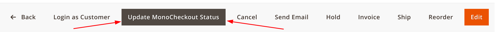
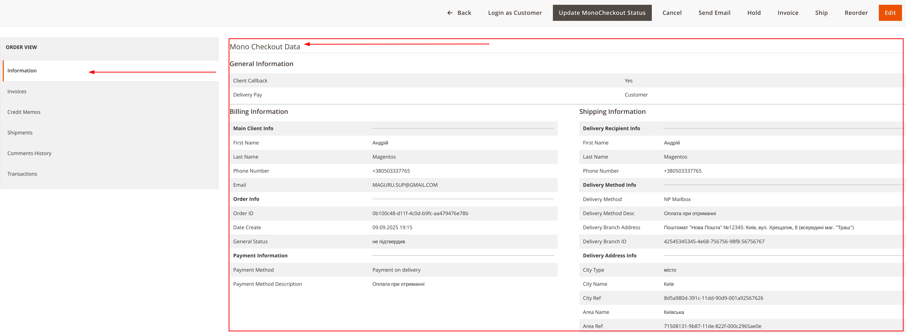

# MonoCheckout Module for Magento 2

## 🛒🛍️ **Order Section**

In the Magento 2 admin panel, within the order management section where the **MonoCheckout** payment method is used, there is special functionality.

#### Data Update Button
- **Location**: On the order view page
- **Purpose**: Allows manual updating of transaction data and order status from the MonoBank system
- **Button Name**: "Update MonoCheckout Status"
> 

#### "Information" Tab
In the "Information" tab, there is a separate subsection:

##### **Mono Checkout Data**
A special section that displays data specific to the MonoCheckout module.
> 
---

### MonoCheckout Data Structure

#### General Order Information
- **Call the customer** - Yes or No
- **Delivery payment** - Who pays for the delivery
- **Comment** - Comment from the payment form

#### Payment Information
- **Basic customer information**
- **Order information** - information about the payment application
- **Payment information** - payment policies and terms

#### Delivery Information
- **Recipient delivery information**
- **Delivery method information**
- **Delivery address information**

---

### Functional Capabilities

The MonoCheckout module provides the following functions in the admin panel:

1. **Display of special data** for payments through MonoCheckout
2. **Ability to update status** manually via the "Update MonoCheckout Status" button
3. **Structured presentation** of information in a separate subsection

```
The module provides a convenient interface for managing orders with payment through MonoCheckout without the need to leave the Magento admin panel.
```
>>---

## 👨🏻‍💻 **Developers**

### There are additional events in the code for eventManager

#### mono_checkout_postdeliveryfee_collect_rates_before
- quote type *\Magento\Quote\Api\Data\CartInterface*
- request_data type *Array*
- address type *\Magento\Quote\Api\Data\AddressInterface*

#### mono_checkout_postdeliveryfee_make_response_before
- quote type *\Magento\Quote\Api\Data\CartInterface*
- request_data type *Array*
- address type *\Magento\Quote\Api\Data\AddressInterface*
- ratesList type *Array*

#### mono_checkout_callback_save_payment_before
- payment type *\Magento\Sales\Api\Data\OrderPaymentInterface*
- order type *\Magento\Sales\Api\Data\OrderInterface*
- monoOrder type *\MaGuru\MonoCheckout\Api\MonoData\MonoOrderInterface*
- customer type *\Magento\Customer\Api\Data\CustomerInterface*

#### mono_checkout_callback_save_address_before
- address type *\Magento\Customer\Model\Address\AddressModelInterface*
- order type *\Magento\Sales\Api\Data\OrderInterface*
- monoOrder type *\MaGuru\MonoCheckout\Api\MonoData\MonoOrderInterface*
- customer type *\Magento\Customer\Api\Data\CustomerInterface*

#### mono_checkout_callback_prepare_invoice
- order type *\Magento\Sales\Api\Data\OrderInterface*
- monoOrder type *\MaGuru\MonoCheckout\Api\MonoData\MonoOrderInterface*
- customer type *\Magento\Customer\Api\Data\CustomerInterface*

#### mono_checkout_callback_create_invoice_after
- order type *\Magento\Sales\Api\Data\OrderInterface*
- monoOrder type *\MaGuru\MonoCheckout\Api\MonoData\MonoOrderInterface*
- customer type *\Magento\Customer\Api\Data\CustomerInterface*
- invoice type *\Magento\Sales\Api\Data\InvoiceInterface*

#### mono_checkout_callback_save_order_before
- order type *\Magento\Sales\Api\Data\OrderInterface*
- monoOrder type *\MaGuru\MonoCheckout\Api\MonoData\MonoOrderInterface*
- customer type *\Magento\Customer\Api\Data\CustomerInterface*

#### mono_checkout_create_new_customer_before
- order type *\Magento\Sales\Api\Data\OrderInterface*
- monoOrder type *\MaGuru\MonoCheckout\Api\MonoData\MonoOrderInterface*
- customer type *\Magento\Customer\Api\Data\CustomerInterface*

#### mono_checkout_validate_promocode_before
- quote type *\Magento\Quote\Api\Data\CartInterface*
- request_data type *Array*

