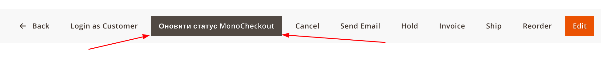
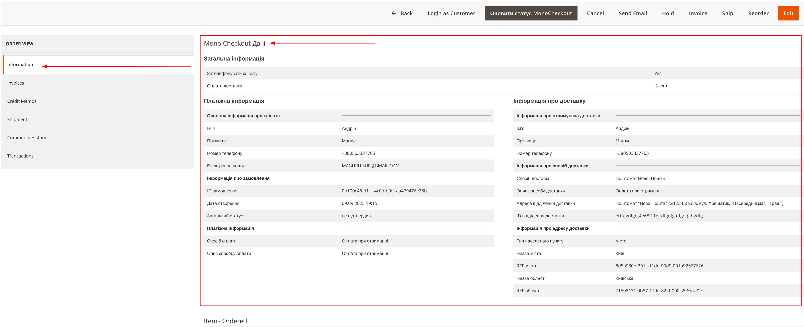

# Модуль MonoCheckout для Magento 2

## Розділ замовлення

У адмін-панелі Magento 2 в розділі управління замовленнями, де використовується метод оплати **MonoCheckout**, присутній спеціальний функціонал.

#### Кнопка оновлення даних
- **Розташування**: На сторінці перегляду замовлення
- **Призначення**: Дозволяє вручну оновити дані транзакції та статус замовлення з системи MonoBank
- **Назва кнопки**: "Оновити статус MonoCheckout"
> 

#### Вкладка "Information"
У вкладці "Information" (Інформація) присутній окремий підрозділ:

##### **Mono Checkout Дані**
Спеціальна секція, яка відображає дані, специфічні для модуля MonoCheckout.
> 
---

### Структура даних MonoCheckout

#### Загальна інформація про замовлення
- **Зателефонувати клієнту** - Так або Ні
- **Оплата доставки** - Хто оплачує доставку
- **Коментар** - Коментар з форми оплати

#### Платіжна інформація
- **Основна інформація про клієнта**
- **Інформація про замовлення** - інформація про платіжну заявку
- **Платіжна інформація** - політики та умови платежу

#### Інформація про доставку
- **Інформація про отримувача доставки**
- **Інформація про спосіб доставки**
- **Інформація про адресу доставки**

---

### Функціональні можливості

Модуль MonoCheckout надає наступні функції в адмін-панелі:

1. **Відображення спеціальних даних** платежів через MonoCheckout
2. **Можливість оновлення статусу** вручну через кнопку "Оновити статус MonoCheckout"
3. **Структуроване представлення** інформації в окремому підрозділі

```
Модуль забезпечує зручний інтерфейс для управління замовленнями з оплатою через MonoCheckout без необхідності виходу з адмін-панелі Magento.
```

>>---

## 👨🏻‍💻 **Розробникам**

### В коді є додаткові події для eventManager

#### mono_checkout_postdeliveryfee_collect_rates_before
- quote типу *\Magento\Quote\Api\Data\CartInterface*
- request_data типу *Array*
- address типу *\Magento\Quote\Api\Data\AddressInterface*

#### mono_checkout_postdeliveryfee_make_response_before
- quote типу *\Magento\Quote\Api\Data\CartInterface*
- request_data типу *Array*
- address типу *\Magento\Quote\Api\Data\AddressInterface*
- ratesList типу *Array*

#### mono_checkout_callback_save_payment_before
- payment типу *\Magento\Sales\Api\Data\OrderPaymentInterface*
- order типу *\Magento\Sales\Api\Data\OrderInterface*
- monoOrder типу *\MaGuru\MonoCheckout\Api\MonoData\MonoOrderInterface*
- customer типу *\Magento\Customer\Api\Data\CustomerInterface*

#### mono_checkout_callback_save_address_before
- address типу *\Magento\Customer\Model\Address\AddressModelInterface*
- order типу *\Magento\Sales\Api\Data\OrderInterface*
- monoOrder типу *\MaGuru\MonoCheckout\Api\MonoData\MonoOrderInterface*
- customer типу *\Magento\Customer\Api\Data\CustomerInterface*

#### mono_checkout_callback_prepare_invoice
- order типу *\Magento\Sales\Api\Data\OrderInterface*
- monoOrder типу *\MaGuru\MonoCheckout\Api\MonoData\MonoOrderInterface*
- customer типу *\Magento\Customer\Api\Data\CustomerInterface*

#### mono_checkout_callback_create_invoice_after
- order типу *\Magento\Sales\Api\Data\OrderInterface*
- monoOrder типу *\MaGuru\MonoCheckout\Api\MonoData\MonoOrderInterface*
- customer типу *\Magento\Customer\Api\Data\CustomerInterface*
- invoice типу *\Magento\Sales\Api\Data\InvoiceInterface*

#### mono_checkout_callback_save_order_before
- order типу *\Magento\Sales\Api\Data\OrderInterface*
- monoOrder типу *\MaGuru\MonoCheckout\Api\MonoData\MonoOrderInterface*
- customer типу *\Magento\Customer\Api\Data\CustomerInterface*

#### mono_checkout_create_new_customer_before
- order типу *\Magento\Sales\Api\Data\OrderInterface*
- monoOrder типу *\MaGuru\MonoCheckout\Api\MonoData\MonoOrderInterface*
- customer типу *\Magento\Customer\Api\Data\CustomerInterface*

#### mono_checkout_validate_promocode_before
- quote типу *\Magento\Quote\Api\Data\CartInterface*
- request_data типу *Array*